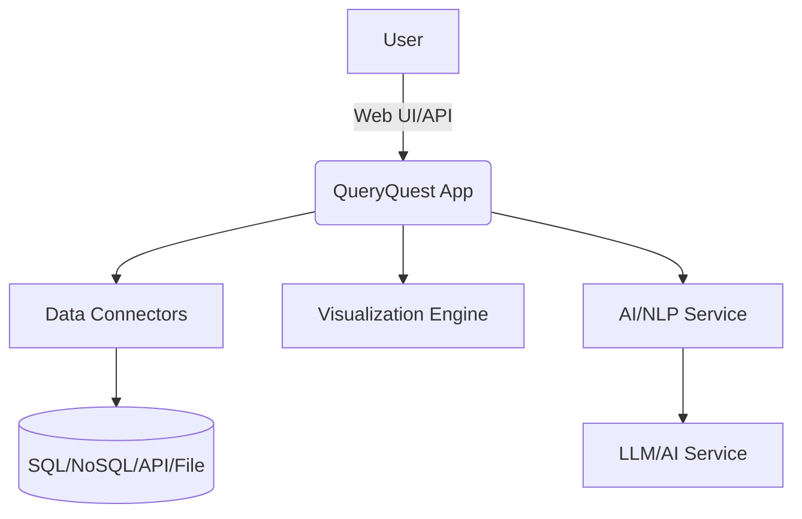

# QueryQuest

[](LICENSE)
[](https://github.com/GouravSittam/QueryQuest/issues)
[](https://github.com/GouravSittam/QueryQuest/pulls)
[](https://github.com/GouravSittam/QueryQuest/graphs/contributors)
[](https://github.com/GouravSittam/QueryQuest/deployments)

---

> **QueryQuest** is an intelligent, extensible, and developer-friendly platform for querying, analyzing, visualizing, and automating data from multiple sources.  
> **Empowering data exploration for developers, analysts, and teams.**

---

## ✨ Key Features

- **Natural Language Querying (AI-Powered)**
  - Ask questions in plain English and get accurate, context-aware results.
  - Built-in support for GPT-based query rewriting and optimization.
- **Multiple Data Connectors**
  - Connect to SQL (MySQL, PostgreSQL, SQLite), NoSQL (MongoDB, Redis), REST/GraphQL APIs, CSV, Excel, Parquet, and more.
  - Easy plugin system for new connectors.
- **Advanced Query Builder**
  - Visual query editor with autocomplete, schema explorer, and code/SQL editor.
  - Save, organize, and version queries.
- **Interactive Data Visualization**
  - Generate charts, dashboards, and custom reports from query results.
  - Export to CSV, Excel, JSON, PNG, PDF.
- **Collaboration & Sharing**
  - Share queries, dashboards, and results securely with your team.
  - Role-based permissions and SSO integration.
- **Automations & Scheduling**
  - Schedule queries and reports, trigger alerts, and integrate with webhooks.
- **Extensible Plugin API**
  - Build and publish custom data connectors, processors, and UI widgets.
- **Robust Security**
  - Fine-grained access control, audit logging, secrets management, and encrypted storage.
- **Modern UI/UX**
  - Responsive, accessible interface with dark mode, keyboard shortcuts, and theming.

---

## 🚦 Quickstart

### 1. Clone & Install

```bash
git clone https://github.com/GouravSittam/QueryQuest.git
cd QueryQuest
npm install    # or yarn install
```

### 2. Configure

```bash
cp .env.example .env
# Edit .env with your database/API credentials and app secrets.
```

### 3. Run

```bash
npm run dev       # Development mode (hot reload)
npm run build     # Build for production
npm start         # Start production server
```

---

## 📷 Screenshots

<p align="center">
  
  
  
</p>

---

## 🔌 Supported Sources

- Relational Databases: `MySQL`, `PostgreSQL`, `SQLite`, `SQL Server`
- NoSQL: `MongoDB`, `Redis`
- Cloud Data Warehouses: `BigQuery`, `Snowflake`, `Redshift`
- REST/GraphQL APIs
- Flat Files: `CSV`, `Excel`, `Parquet`, `JSON`
- Community & Custom Plugins

---

## 🧩 Plugin System

- **Create** new connectors, result processors, or visualization modules.
- **Marketplace** for installing community-driven plugins.
- **TypeScript/Javascript SDK** for fast development.

See [docs/plugins.md](docs/plugins.md) for developer guides and API docs.

---

## 🛡️ Security & Compliance

- OAuth2, JWT, SSO, and 2FA support
- RBAC (Role Based Access Control)
- Data encryption (at rest and in transit)
- Audit trails and query logs
- GDPR & SOC2 ready

---

## 📚 Documentation

- [Getting Started](docs/getting_started.md)
- [Configuration](docs/configuration.md)
- [Plugin Development](docs/plugins.md)
- [REST API](docs/api.md)
- [Security](docs/security.md)
- [FAQ](docs/faq.md)

---

## 🤝 Contributing

We ❤️ contributions!

1. Fork the repository
2. Create your feature branch (`git checkout -b feat/my-feature`)
3. Commit your changes (`git commit -am 'Add some feature'`)
4. Push to the branch (`git push origin feat/my-feature`)
5. Open a [Pull Request](https://github.com/GouravSittam/QueryQuest/pulls)

See [CONTRIBUTING.md](CONTRIBUTING.md).

---

## 📣 Community & Support

- [Discussions](https://github.com/GouravSittam/QueryQuest/discussions)
- [Report Issues](https://github.com/GouravSittam/QueryQuest/issues)
- [Feature Requests](https://github.com/GouravSittam/QueryQuest/issues/new?labels=enhancement)
- [Roadmap](docs/roadmap.md)

---

## 🏗️ Architecture



---

## 📝 License

MIT © [GouravSittam](https://github.com/GouravSittam)

---

## 🌟 Acknowledgements

- Inspired by [Metabase](https://github.com/metabase/metabase), [Redash](https://github.com/getredash/redash), [Superset](https://github.com/apache/superset)
- Huge thanks to all [contributors](https://github.com/GouravSittam/QueryQuest/graphs/contributors) and plugin authors!

---

<p align="center">
  <b>Unleash your data superpowers — with QueryQuest!</b>
</p>
